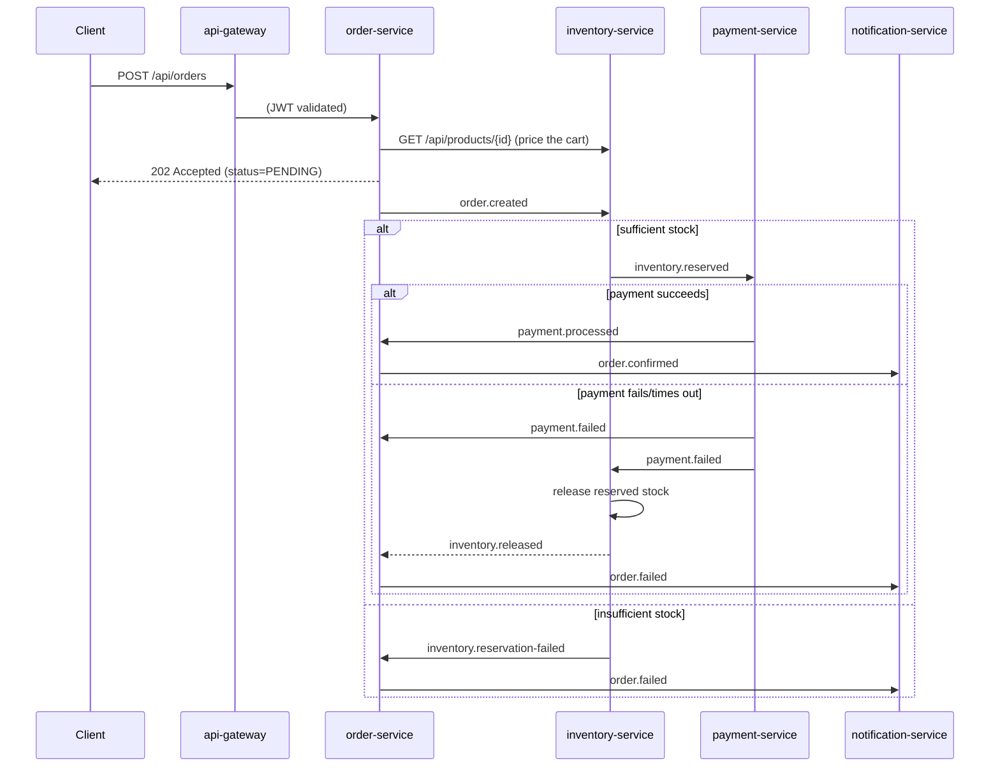

# OrderFlow

A distributed order-processing platform, built in phases from a single Spring Boot monolith up to
a Kafka-choreographed microservices system with observability, CI/CD, and Kubernetes manifests.
See [orderflow-phase1/](orderflow-phase1/) for the Phase 1 monolith (kept as-is, a complete
project in its own right) and [adr/](adr/) for the reasoning behind the bigger decisions below.

## Services

| Service | Port | Owns | README |
|---|---|---|---|
| api-gateway | 8080 | Routing, edge JWT validation, rate limiting | [api-gateway/](api-gateway/) |
| order-service | 8081 | Users/Auth, Orders, saga entry point | [order-service/](order-service/) |
| inventory-service | 8082 | Products, Inventory, stock reservation | [inventory-service/](inventory-service/) |
| payment-service | 8083 | Payments, mock/real charge gateway | [payment-service/](payment-service/) |
| notification-service | 8084 | Order confirmation/failure notifications | [notification-service/](notification-service/) |

## The saga

Placing an order is a choreography saga over Kafka — see
[ADR 0001](adr/0001-choreography-over-orchestration.md) for why choreography over a central
orchestrator, and [ADR 0005](adr/0005-idempotent-consumer-pattern.md) for how every consumer
tolerates Kafka's at-least-once redelivery.



The initial `POST /api/orders` returns **202 Accepted** with the order in `PENDING` status — the
outcome resolves asynchronously. Clients poll `GET /api/orders/{id}` to see it land on `PAID`,
`PAYMENT_FAILED`, `INVENTORY_FAILED`, or (after `POST /api/orders/{id}/cancel`) `CANCELLED`.

## Run it

```bash
docker compose up --build
```

Brings up Postgres (one instance, one database per service — [ADR 0004](adr/0004-database-per-service.md)),
Redis, a single-node KRaft Kafka broker, all five services, and Prometheus + Grafana
(`localhost:3000`, anonymous viewer access enabled for local dev). Gateway is the only externally
exposed API surface at `localhost:8080` — see each service's own README for its Swagger UI.

For Kubernetes instead of Compose, see [k8s/](k8s/).

## CI/CD

[`'.github/workflows/ci.yml`](.github/workflows/ci.yml) runs `mvn verify` (unit + Testcontainers
integration tests) for every service on each PR/push, then builds and pushes images to GHCR on
`main`.

## SDLC

[adr/](adr/) for architecture decisions, [`.github/PULL_REQUEST_TEMPLATE.md`](.github/PULL_REQUEST_TEMPLATE.md)
and [`.github/ISSUE_TEMPLATE/`](.github/ISSUE_TEMPLATE/) for the PR/issue workflow,
[`.github/CODEOWNERS`](.github/CODEOWNERS) mapping each service to a reviewer (update the
placeholder owner once this is pushed to a real GitHub repo — CODEOWNERS-driven review requests
and a GitHub Projects board tracking phases as epics only work once this actually lives on
GitHub, which is outside what a local working copy can set up on its own).

## What's real vs. what's stubbed

Everything above runs end-to-end locally. Two things are deliberately config-driven placeholders
rather than faked: real Stripe/SendGrid calls need your own test-mode API keys (see
`payment-service`/`notification-service` READMEs for the env vars — `MockPaymentGateway`/
`MockNotificationSender` stay active with no keys set), and nothing here is deployed to a live
public URL — that needs your own cloud account/registry credentials wired into CI, which isn't
something that can be set up without them.
